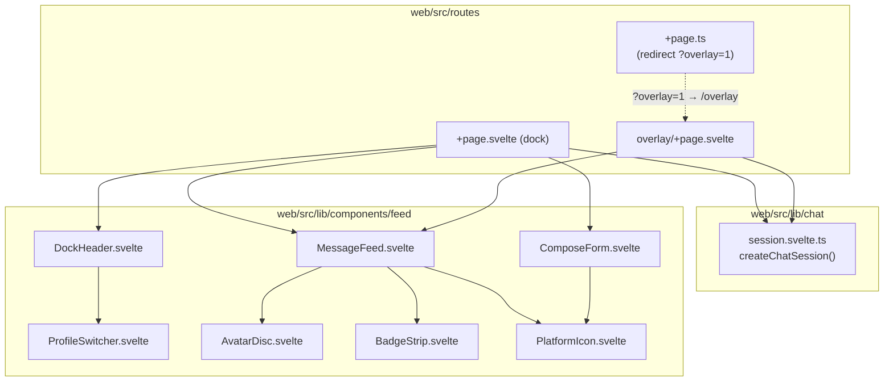
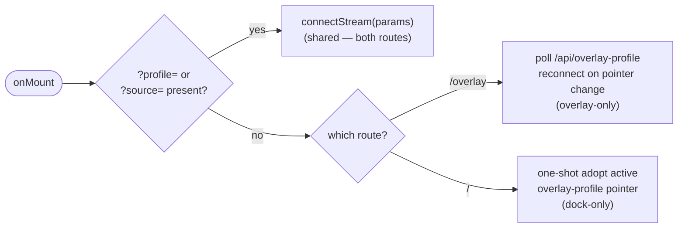

# All Chat — Dock/Overlay Route Split (EDD-dock-overlay-split)

| | |
|---|---|
| **Status** | Draft |
| **Date** | 2026-08-18 |
| **Scope** | Split `routes/+page.svelte` into dock (`/`) and overlay (`/overlay`) routes, with shared chat-session logic and extracted presentational components |
| **Author** | Gregory McQuillan |
| **License** | This document is CC BY-SA 4.0 — see [docs/LICENSE](LICENSE). Source code elsewhere in this repo is licensed separately (root [LICENSE](../LICENSE), [shared/contract/LICENSE](../shared/contract/LICENSE)). |
| **Builds on** | [2026-07-19-all-chat.edd.md](2026-07-19-all-chat.edd.md) (v1), [2026-07-20-all-chat-v2.edd.md](2026-07-20-all-chat-v2.edd.md), and [2026-08-17-message-timestamps.edd.md](2026-08-17-message-timestamps.edd.md). Sections below reference these by anchor rather than restate them. |

## 1. Overview

`web/src/routes/+page.svelte` is 749 lines doing five jobs at once: dock
chrome (header, nav, display toggles), the OBS overlay (profile-agnostic
pointer polling, fade eviction, minimal chrome), profile switching, the
chat-session/stream lifecycle (SSE connect, message buffering, scroll
pinning), and the compose form. Overlay vs. dock is a single route gated by
`?overlay=1`, which forces `class:overlay`/`{#if !overlayMode}` branching
through both the markup and the `<style>` block. This makes the file hard
to scan and risks dock changes accidentally breaking the OBS overlay (or
vice versa).

This doc designs splitting overlay onto its own route (`/overlay`) — the two
views share little markup once `overlayMode` branching is removed — and
extracting the remaining presentational + stateful pieces into components
and a shared session module, so `+page.svelte` shrinks to route-specific
bootstrap + composition.

## 2. Goals / Non-goals

### Goals

- Move the OBS overlay to its own route (`/overlay`), removing `overlayMode`
  conditionals from dock markup/CSS.
- Extract chat-session state (messages, `connectStream`, `sendMessage`,
  scroll/flush buffering, fade eviction) into a shared reactive module used
  by both routes, so stream/buffering logic isn't duplicated.
- Extract feed rendering, the compose form, and the dock header into
  standalone components under `web/src/lib/components/feed/`.
- Preserve existing OBS browser-source URLs (`/?overlay=1&...`) via a
  redirect to `/overlay?...`.

### Non-goals

- Any change to overlay/dock *behavior* — this is a structural split, output
  should be pixel- and behavior-identical.
- Any change to `ChatMessage`, normalizers, or SSE transport.
- Introducing Svelte stores/context — reactive state stays local to each
  route via the new session factory, matching the current all-local-`$state`
  pattern (no stores/context exist anywhere in `web/src/lib` today).
- Route groups (`(group)` folders) — `overlay/` as a plain nested route
  matches the existing flat `admin/`, `login/`, `profiles/` convention.

## 3. Current state

`web/src/routes/+page.svelte`'s `onMount` (lines 262–374) has three
mutually exclusive bootstrap branches, keyed off `explicitTarget =
params.has('profile') || params.has('source')`:

| Branch | Condition | Behavior | Lines |
|---|---|---|---|
| 1. Explicit target | `explicitTarget` | Connect directly via `?profile=`/`?source=` | 296–309 |
| 2. Overlay pointer | `overlayMode && !explicitTarget` | Poll `/api/overlay-profile` every `OVERLAY_POINTER_POLL_MS`, reconnect stream when the pointer changes | 310–344 |
| 3. Bare dock default | `!overlayMode && !explicitTarget` | One-shot adopt the active overlay-profile pointer into the dock view | 345–366 |

Branch 1 is shared by both routes. Branch 2 is overlay-exclusive. Branch 3
is dock-exclusive. This three-way split is already clean in the existing
code — the route split follows it directly rather than inventing new
conditions.

Fade eviction (`fadeSeconds`/`sweepExpired`, lines 137–145, 283–289) is
**not** overlay-exclusive — `?fade=` works on either route today — so it
stays in the shared session module rather than being gated behind overlay.

Display-option defaults (`showIcons`/`showAvatars`/`showTimestamps`, lines
54–67) already differ by route (overlay defaults avatars/timestamps off);
each route computes its own from `page.url.searchParams` in `onMount` (~8
lines), which is left duplicated rather than abstracted further.

Existing component extraction convention (`web/src/lib/components/feed/`:
`AvatarDisc.svelte`, `BadgeStrip.svelte`, `PlatformIcon.svelte`,
`ProfileSwitcher.svelte`) — PascalCase, colocated by feature area — is
followed for the new components.

## 4. Directory structure changes

```
web/src/routes/
  +page.svelte                     # dock only — header, feed, compose
  +page.ts                         # NEW — redirects ?overlay=1 → /overlay
  overlay/
    +page.svelte                   # NEW — overlay only, no header/compose

web/src/lib/
  chat/
    session.svelte.ts              # NEW — shared reactive chat session
  components/
    feed/
      AvatarDisc.svelte            # existing, unchanged
      BadgeStrip.svelte            # existing, unchanged
      PlatformIcon.svelte          # existing, unchanged
      ProfileSwitcher.svelte       # existing, unchanged
      MessageFeed.svelte           # NEW — <ul>/<li> feed + resume pill
      ComposeForm.svelte           # NEW — compose textarea + send results
      DockHeader.svelte            # NEW — dock header/nav/toggles
```

## 5. Component / module relationships



## 6. Bootstrap branch split



## 7. `session.svelte.ts` shape

A factory (not a singleton), since two route instances must not share
state:

```ts
// web/src/lib/chat/session.svelte.ts
export function createChatSession() {
  // $state: messages, statuses, connected, streamError, hasParams,
  //         feedElement, stickToBottom, missedCount, fadeSeconds, receivedAt
  // methods: connectStream(params), sendMessage(text), onFeedScroll,
  //          resumeScroll, scrollToBottom, sweepExpired, dispose()
  return { /* state + methods */ };
}
```

Each route calls `const session = createChatSession();` in its `<script>`
and passes `session` (or destructured pieces) into `MessageFeed` /
`ComposeForm` as props.

## 8. File-by-file changes

- **`web/src/lib/chat/session.svelte.ts`** (new): extracted from
  `+page.svelte` lines 29–164, 199–223 — message state, buffering
  (`scheduleFlush`/`flushMessages`), fade sweep, scroll pinning,
  `connectStream`, `sendMessage`.
- **`web/src/lib/components/feed/MessageFeed.svelte`** (new): extracted
  markup from lines 424–465 (feed `<ul>`/`<li>` + resume pill) plus the
  scoped feed CSS. Props: session state slice +
  `showIcons`/`showAvatars`/`showTimestamps`/`overlayMode` (the last for
  `fade` transition + text-shadow stroke styling).
- **`web/src/lib/components/feed/ComposeForm.svelte`** (new): extracted
  from lines 467–493 (`composeText`/`sending`/`sendResults`/`sendError` +
  markup) plus its scoped CSS. Dock-only, takes `session.sendMessage` as a
  prop/callback.
- **`web/src/lib/components/feed/DockHeader.svelte`** (new): extracted from
  lines 383–408 (title, `ProfileSwitcher`, version tag, status dots, nav
  links, icon/avatar/timestamp/theme toggle buttons) plus header CSS.
  Dock-only.
- **`web/src/routes/+page.svelte`** (rewritten, dock-only): keeps profile
  state/`switchProfile` (lines 37–43, 226–259), theme state, display-option
  computation, bootstrap branches 1 and 3, and composes `DockHeader` +
  `MessageFeed` + `ComposeForm` around `session`. Drops all `overlayMode`
  conditionals and the overlay CSS block (lines 708–741).
- **`web/src/routes/+page.ts`** (new): `load` that checks
  `url.searchParams.get('overlay') === '1'` and issues a redirect to
  `/overlay` with the `overlay` param stripped and the rest preserved.
- **`web/src/routes/overlay/+page.svelte`** (new): profile-agnostic pointer
  polling bootstrap (branch 2), fade/display-option computation, composes
  only `MessageFeed` around `session`. No header, no compose form, no
  `ProfileSwitcher`.

## 9. Design decisions

- **Route, not just a component split, for overlay.** Once `overlayMode`
  conditionals are removed, dock and overlay share only the feed list —
  header, compose, and nav are dock-exclusive. A route boundary makes that
  exclusion structural instead of a scatter of `{#if !overlayMode}` checks.
- **Shared session as a factory, not a store.** Matches the existing
  no-stores/no-context convention (§2 non-goals) and avoids cross-route
  state leakage — dock and overlay are genuinely independent sessions even
  when pointed at the same profile.
- **Redirect over dual-URL support.** A `+page.ts` load-time redirect keeps
  exactly one canonical overlay URL going forward while existing OBS
  browser sources (`/?overlay=1&...`) keep working unchanged.
- **Fade eviction lives in the shared session, not overlay-only**, because
  `?fade=` is already usable from the dock route today (§3) — moving it
  into an overlay-only module would be a silent behavior change.

## 10. Suggested atomic step order

Each step is its own turn/commit, buildable and independently testable, per
the incremental-development workflow:

1. Add `session.svelte.ts`, wire it into the existing `+page.svelte`
   in-place (no route split yet, no behavior change) — proves the
   extraction is behavior-preserving before touching routes.
2. Extract `MessageFeed.svelte`, use it from `+page.svelte`.
3. Extract `ComposeForm.svelte`, use it from `+page.svelte`.
4. Extract `DockHeader.svelte`, use it from `+page.svelte`.
5. Create `overlay/+page.svelte` (composing `session` + `MessageFeed`),
   remove overlay-only branches/CSS from `+page.svelte`.
6. Add `+page.ts` redirect for `?overlay=1` → `/overlay`.

## 11. Verification

- After each step: `cd web && npm run check` (svelte-check/type-check) and
  `npm run build` stay green.
- Manual: load `/` (dock) and confirm header, toggles, compose, and message
  feed behave identically to before.
- Manual: load `/overlay?profile=<id>` and `/overlay` (bare, pointer-driven)
  and confirm fade, minimal chrome, and profile-agnostic switching still
  work as before.
- Manual: load `/?overlay=1&profile=<id>` and confirm it redirects to
  `/overlay?profile=<id>`.
- Re-check the OBS overlay scoped CSS (text-shadow stroke, transitions)
  renders identically once moved into `MessageFeed.svelte`.

## 12. Open questions

- None outstanding — URL backward-compat (redirect) and session-sharing
  strategy (factory, extracted now rather than deferred) were confirmed
  before this draft.
