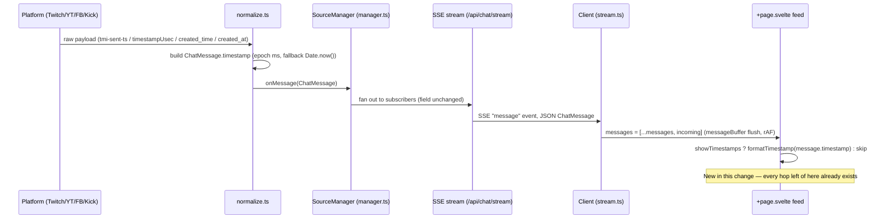
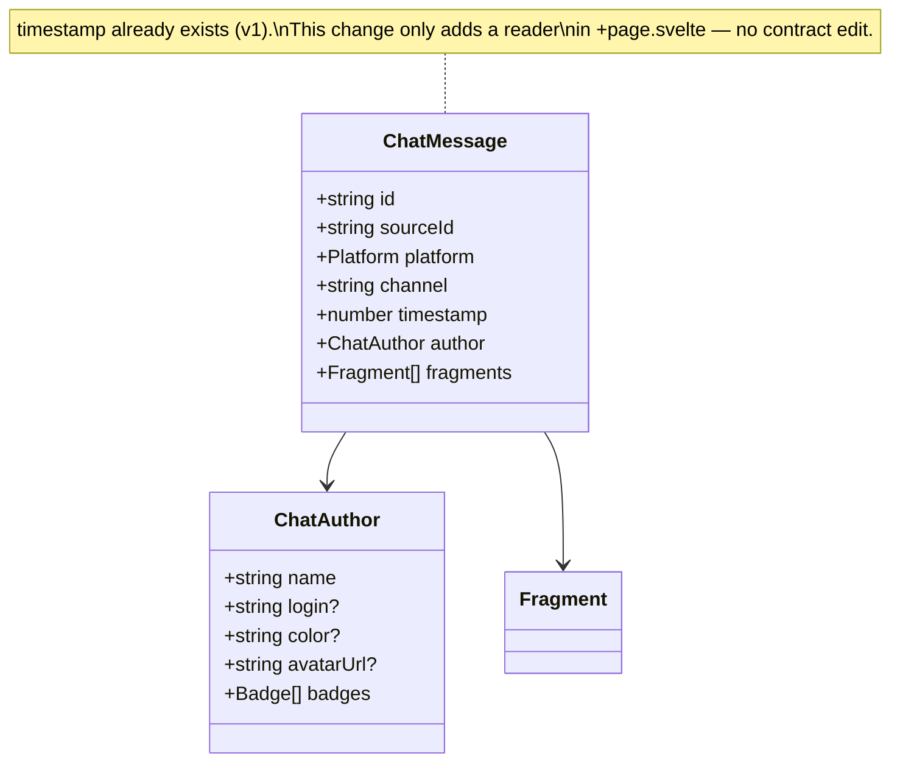
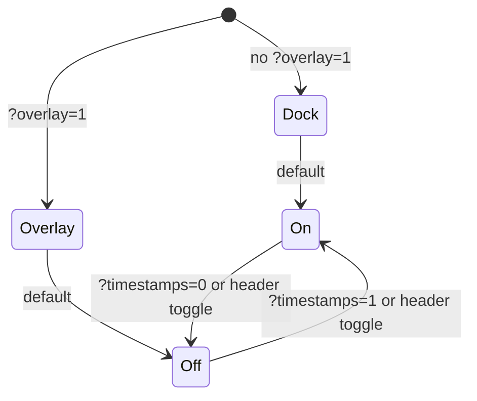

# All Chat — Message Timestamps (EDD-timestamps)

**Status:** Draft
**Date:** 2026-08-17
**Scope:** Display existing message timestamps in the feed UI
**Author:** Gregory McQuillan
**License:** This document is CC BY-SA 4.0 — see [docs/LICENSE](LICENSE). Source code elsewhere in this repo is licensed separately (root [LICENSE](../LICENSE), [shared/contract/LICENSE](../shared/contract/LICENSE)).
**Builds on:** [EDD.md](EDD.md) (v1) and [EDD-V2.md](EDD-V2.md). Sections below reference both by anchor rather than restate them.

## 1. Overview

There's no way to tell when a chat message arrived — the feed shows author, badges, and text, but no time. The data already exists: `ChatMessage.timestamp` (contract `index.ts:84`) has been part of the wire format since v1, and every platform normalizer already populates it from the platform's own timestamp. What's missing is purely presentational — the UI never reads the field. This doc designs that one change: render `message.timestamp`, toggleable, overlay-safe by default.

A related but explicitly separate concern: client-side message-history caching is planned as future work. This doc doesn't design it, but §8 notes why today's fields (`timestamp`, `id`) already support it without a schema change later.

## 2. Goals / Non-goals

### Goals

- Display each message's timestamp in the feed.
- Toggleable via a `&timestamps=` query param and a header button, consistent with the existing `icons`/`avatars` toggles ([EDD §4.2](EDD.md#42-unified-feed-behavior), `+page.svelte`).
- Overlay-safe default: on in the dock, off in overlay mode, matching `showAvatars`'s existing rationale (visual noise on-stream).

### Non-goals

- Message history persistence/caching (client-side or server-side) — future work, own design doc when scoped.
- Relative/live-updating time ("2m ago") — rejected for this pass; would require a ticking interval against a feed documented at 10k+ msg/min ([EDD §7](EDD.md#7-risks), risks table), for marginal benefit over absolute time.
- Any change to `ChatMessage`, the normalizers, or the SSE transport — all already correct (§3).

## 3. Current state — where the value already lives

Each platform's `normalize.ts` maps a different native field into the one contract field, all falling back to `Date.now()` (arrival time) when the platform's own value is missing or unparseable:

| Platform | Native field | Normalizer | Line |
|---|---|---|---|
| Twitch | `tmi-sent-ts` IRC tag | `web/src/lib/server/sources/twitch/normalize.ts` | 104 |
| YouTube | `timestampUsec` (µs) | `web/src/lib/server/sources/youtube/normalize.ts` | 112 |
| Facebook | `created_time` (ISO) | `web/src/lib/server/sources/facebook/normalize.ts` | 24 |
| Kick | `created_at` (ISO) | `web/src/lib/server/sources/kick/normalize.ts` | 131 |

This matches `ChatMessage.timestamp`'s existing doc comment: "Epoch milliseconds (arrival time if the platform omits it)." **No server or contract change is needed** — this doc is scoped entirely to the client.

## 4. Data flow

End-to-end, platform payload to rendered pixel. The timestamp is carried untouched through every existing hop; only the last one (feed render) is new:

## 5. Contract shape

No fields added. Shown to make explicit which existing type the change reads from, and that it's unmodified:

## 6. Client-side toggle state

`showTimestamps` resolves the same way `showAvatars` does today: overlay mode flips the default, an explicit query param always wins, and the header button flips it live afterward.

## 7. Design decisions

- **Format: absolute, locale time** via `toLocaleTimeString()`. No ticking interval — cheap even at the feed's documented throughput ([EDD §7](EDD.md#7-risks)), unlike a relative-time format that would need to re-render as time passes.
- **Default visibility: on in the dock, off in overlay.** Same split as `showAvatars` (`+page.svelte:51-53,197-199`) — the operator's own chat view benefits from timestamps; the transparent on-stream view (typically an OBS browser source) shouldn't gain visual noise by default. Overridable per-instance via `&timestamps=`.
- **Toggle mechanism: query param + header button**, mirroring `showIcons`/`showAvatars` exactly rather than inventing a new pattern.

## 8. Open questions

- Future client-side message-history cache: `message.timestamp` (server-authoritative, stable across reconnects) and `message.id` (already the feed's `#each` key) are the two fields such a cache would key/sort on. No schema change is anticipated when that work is scoped — noted here so that future doc doesn't need to re-derive it.
