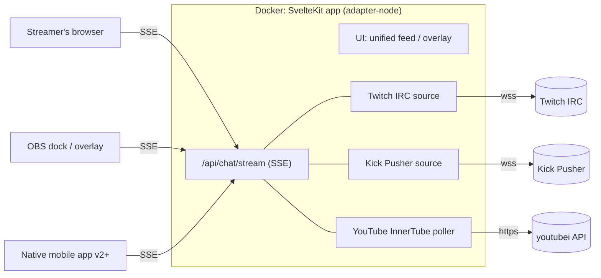
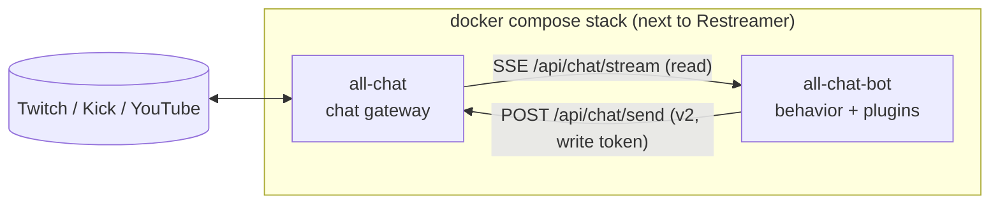

# All Chat — Engineering Design Doc (EDD)

**Status:** Draft
**Date:** 2026-07-19
**Scope:** [MVP](#def-mvp) (v1)

*Acronyms link to the [glossary](#11-glossary) on first use.*

## 1. Overview

All Chat is a self-hosted web app for streamers who broadcast to multiple platforms simultaneously (e.g. via [Restreamer](https://datarhei.github.io/restreamer/) or similar multistreaming setups). It aggregates live chat from Twitch, Kick, and YouTube into a single unified message feed, with first-class [OBS](#def-obs) (Open Broadcaster Software) integration (dockable panel + on-stream overlay). It is the chat-side companion to a video-side multistream stack: same deployment shape (a Docker container on the streamer's box), zero platform logins.

Streams are organized into **profiles** — named groups of chat sources matching how a streamer actually goes live. A "Gaming" profile might contain `twitch/gmpekk`, `kick/gmpekk`, and `youtube/@gmpekk`; a "Game Dev" profile might contain `twitch/gmpekk`, `twitch/gmpekk`, and `youtube/@smallindie`. A profile is an **array of sources, not a platform→channel map**: the same platform can appear any number of times.

The app is read-only in v1: it displays messages but cannot send them. This keeps the MVP free of login/auth flows — every supported platform has an anonymous read path.

**Scale assumption:** self-hosted, one streamer (plus their OBS instances and maybe a phone) per deployment. Single-digit concurrent clients, a handful of upstream connections. No horizontal scaling, no external datastore — in-process state and a [JSON](#def-json) file cover it.

### Design principles

- **One app, one container.** A single SvelteKit application serves the [UI](#def-ui) and all server-side ingestion. Deployed as a Docker image on the streamer's machine, [LAN](#def-lan), or cloud.
- **[API](#def-api)-first: all ingestion server-side, clients are thin.** The server connects to every platform and exposes one unified [SSE](#def-sse) (Server-Sent Events) stream of normalized messages. The web UI, OBS dock, OBS overlay, and any future native mobile client are all equal consumers of the same endpoint — the message schema is a versioned API contract, and nothing in it is SvelteKit-specific. One upstream connection per platform+channel (refcounted), fanned out to any number of clients.
- **Everything is a [URL](#def-url).** Profile, view mode, and overlay styling ride URL params (`/?profile=gaming&overlay=1`), so any view can be bookmarked, shared, docked into OBS, or used as a browser source with zero extra setup.
- **Profiles are server-side state.** Stored in a JSON file on a Docker volume — stable across restarts, shared by every client, editable from any of them. localStorage holds only per-device UI preferences.
- **No accounts, no secrets.** v1 stores nothing but profiles (names + public channel identifiers).

## 2. Goals / Non-goals

### Goals (v1)

- Stream profiles: named source groups, any mix of platforms, duplicates allowed; create/edit/switch in the UI.
- Unified single-window feed merging live chat from Twitch, Kick, and YouTube.
- OBS integration:
  - **Custom browser dock** — the unified feed as a panel inside the OBS UI.
  - **Browser source overlay** — transparent-background chat rendered on stream.
- Ships as a Docker image; runs on localhost, LAN, or cloud host.
- Dark mode: defaults to system preference, manual toggle persisted per device (§5).
- No login required for anything in v1.

### Non-goals (v1, deferred to v2)

- **Sending messages** to any platform (requires per-platform [OAuth](#def-oauth)).
- **Facebook Live/Gaming support.** Facebook has no anonymous chat read path — its [Graph API](#def-graph-api) requires page tokens, and [DOM](#def-dom) scraping is fragile. Facebook lands in v2 alongside the auth flow, which it needs anyway.
- Moderation actions (timeouts, bans, deletes).
- Message persistence, search, or analytics.
- Third-party emotes (7TV/BTTV/FFZ) — fragment model accommodates them later.
- **Grid view (side-by-side per-source panes).** Originally planned as a fallback for when merging wasn't possible; the server-side ingestion design makes the merge unconditional, so the fallback has no reason to exist. Not a feature. Revisit only if unified merging fails in practice.

## 3. Platform ingestion

All ingestion runs server-side. Per-platform mechanics:

| Platform | Transport (server ↔ platform) | Anonymous read? | Notes |
|----------|-------------------------------|-----------------|-------|
| Twitch | [IRC](#def-irc) over [WebSocket](#def-websocket) (`wss://irc-ws.chat.twitch.tv:443`) | Yes (`justinfan<digits>` nick, no auth) | Rock-solid, documented, used by every chat tool |
| Kick | [Pusher](#def-pusher) WebSocket (public app key) + `kick.com/api` lookup | Yes | Unofficial API; lookup is behind Cloudflare |
| YouTube | [InnerTube](#def-innertube) API polling (`youtubei/v1/live_chat/get_live_chat`) | Yes (no API key/quota — same endpoint the watch page uses) | Poll interval dictated by server responses |
| Facebook | Graph API / DOM scraping | No | Deferred to v2 |

### 3.1 Twitch

Anonymous WebSocket to Twitch IRC: `NICK justinfan12345`, `JOIN #channel`, request tags capability (`CAP REQ :twitch.tv/tags`) for display colors, badges, and emote ranges. Parse PRIVMSG into normalized messages. Reconnect with backoff; answer server PING. The IRC subset is small — minimal hand-rolled parser, no library.

References: [Twitch IRC docs](https://dev.twitch.tv/docs/chat/irc/) (message format, capabilities, tag definitions), [IRCv3 message-tags spec](https://ircv3.net/specs/extensions/message-tags.html) (the `@key=value;…` tag prefix and its escaping rules), RFC 1459 §2.3.1 (base grammar). Sample wire line and its parsed form live in the parser's docstring (`web/src/lib/server/sources/twitch/irc.ts`).

### 3.2 Kick

1. **Resolve channel → chatroom ID:** `GET https://kick.com/api/v2/channels/{slug}` returns `chatroom.id`. Results cached; on Cloudflare blocks, UI falls back to prompting for a manually entered chatroom ID.
2. **Subscribe:** Pusher WebSocket with Kick's public app key (`wss://ws-us2.pusher.com/app/<key>?protocol=7`), `pusher:subscribe` to `chatrooms.<id>.v2`. `ChatMessage` events carry sender, badges, color, emote placeholders.

Risk: unofficial API; Kick has churned the Pusher key/cluster before. All Kick constants isolated in one module (`web/src/lib/server/sources/kick/constants.ts`); breakage treated as expected maintenance. The Pusher key is public (every kick.com visitor's browser receives it); when it rotates, re-derive it from kick.com via browser DevTools → Network → WS filter → the `wss://ws-<cluster>.pusher.com/app/<key>?protocol=7` connection URL, and cross-check against community Kick client libraries on GitHub, which track rotations quickly.

Because rotation is expected maintenance, the key and cluster host are overridable without a code change via `KICK_PUSHER_KEY` / `KICK_PUSHER_HOST` environment variables (set in the container env, restart to apply — see `.env.example`). A control-panel setting (stored in `/data/config.json`) is planned for v2 once the §6.1 auth exists; exposing runtime config mutation on an unauthenticated deployment would let anyone on the network repoint the connection.

### 3.3 YouTube

The watch page's own chat uses InnerTube's `youtubei/v1/live_chat/get_live_chat` — no API key or quota:

1. Resolve input (video URL, video ID, or `@handle`) to a live video ID (`youtube.com/@handle/live` redirect).
2. Fetch the initial live-chat continuation token from the video page.
3. Poll `get_live_chat` at the server-suggested interval (typically ~1–5 s), normalize messages.

### 3.4 API surface (SvelteKit server routes, consumable by any client)

**Chat stream:**

- `GET /api/chat/stream?profile=<idOrName>` — **the** endpoint: unified SSE stream (`text/event-stream`) of normalized `ChatMessage` JSON from every source in the profile, plus `status` events per source (connecting / live / reconnecting / failed). Events tag the originating `sourceId`, so clients can tell apart two sources on the same platform.
- Ad-hoc form (no profile needed): `GET /api/chat/stream?source=twitch:gmpekk&source=twitch:gmpekk&source=youtube:@smallindie` — repeated `source=platform:channel` params, duplicates of a platform welcome.

**Profiles ([CRUD](#def-crud)):**

- `GET /api/profiles` — list.
- `POST /api/profiles` — create `{ name, sources: SourceConfig[] }`.
- `PUT /api/profiles/[id]` / `DELETE /api/profiles/[id]`.
- Persisted to `/data/profiles.json` (Docker volume). Writes are atomic (write-temp-then-rename); at this scale a JSON file is the right database.

**Helpers:**

- `GET /api/youtube/resolve/[input]` — URL/ID/handle → live video ID (also used internally by the stream route).
- `GET /api/kick/channel/[slug]` — chatroom ID lookup (cached; exposed for the manual-fallback [UX](#def-ux)).
- `GET /api/health` — liveness.

No credentials anywhere. Upstream connections are keyed by platform+channel and refcounted: the first subscriber to a source opens the upstream connection, later subscribers share it — including across profiles (two profiles containing `twitch/gmpekk` share one IRC connection). If the same source appears twice within one profile, it is deduplicated at connection level and delivered once. SSE (not WebSocket) because the v1 flow is one-way, it fits SvelteKit routes natively, and every mobile [HTTP](#def-http) stack speaks it; v2 message-sending will use plain POST endpoints alongside the stream.

## 4. Architecture



- Each platform implements a common server-side `ChatSource` interface: `connect(config)`, `disconnect()`, `onMessage(cb)`, `onStatus(cb)`. A source manager refcounts live sources per platform+channel and fans messages out to every subscribed SSE client. Adding Facebook in v2 means one more `ChatSource`.
- The web frontend is itself just an SSE consumer — same contract a native mobile client would use. Per-source connection status surfaces in the UI from the stream's `status` events.

### 4.1 Normalized message model

```ts
interface Profile {
  id: string;              // stable slug, generated from name
  name: string;            // "Gaming", "Game Dev"
  sources: SourceConfig[]; // ordered array — same platform may repeat
}

interface SourceConfig {
  id: string;              // stable per-source id (used in ChatMessage.sourceId)
  platform: 'twitch' | 'kick' | 'youtube';
  channel: string;         // twitch/kick channel slug, or youtube URL/ID/@handle
  label?: string;          // optional display name ("Main Twitch", "Indie YT")
}

interface ChatMessage {
  id: string;            // platform message id, or synthesized
  sourceId: string;      // which SourceConfig produced this message
  platform: 'twitch' | 'kick' | 'youtube';
  channel: string;       // channel the message came from
  timestamp: number;     // epoch ms (arrival time if platform omits it)
  author: {
    name: string;
    color?: string;      // platform-provided or hash-derived (see below)
    avatarUrl?: string;  // platform-provided when available (see below)
    badges: Badge[];     // normalized: broadcaster, mod, subscriber, verified, ...
  };
  fragments: Fragment[]; // ordered text + emote fragments
}

type Fragment =
  | { kind: 'text'; text: string }
  | { kind: 'emote'; name: string; url: string };
```

Emotes render as inline images from each platform's public [CDN](#def-cdn) (all three serve emote images without auth).

**Author color and avatar availability is asymmetric across platforms** (verified):

| | Name color | Avatar in chat payload |
|---|---|---|
| Twitch | ✓ IRC `color` tag (user-chosen hex) | ✗ — requires [Helix](#def-helix) API (OAuth) or third-party lookup |
| Kick | ✓ `sender.identity.color` hex | ✗ — requires profile lookup |
| YouTube | ✗ — user name colors don't exist on YouTube chat | ✓ `authorPhoto.thumbnails[]` in every message |

Handling:

- `color`: pass through when the platform provides it; otherwise derive a stable hue from a hash of the author name (YouTube, and Twitch users who never set a color). Merged feed looks uniform either way.
- `avatarUrl`: optional by design. v1 populates it for YouTube only (free in the payload). Twitch/Kick avatar **enrichment** is v2: a server-side per-user lookup with an [LRU](#def-lru)+[TTL](#def-ttl) cache — Twitch via Helix once platform OAuth exists, Kick via its profile API (same Cloudflare caveats as the channel lookup). The field exists in the contract from day one so enrichment changes no schema.
- Renderers must treat `avatarUrl` as absent-friendly: fallback is a colored-initial disc (using `author.color`), so a mixed feed (YouTube with photos, Twitch/Kick with discs) stays visually coherent.

This schema is the API contract for all clients (web, OBS, future mobile). Wire format is JSON over SSE; the stream is versioned via an `X-AllChat-API` response header and an initial `hello` event carrying `{ apiVersion }`, so native clients can detect drift. Types live in `shared/contract/` (§5) and are the single source of truth for the server, the web UI, and — via JSON Schema codegen — the native mobile apps.

### 4.2 Unified feed behavior

- Messages append in arrival order (not timestamp-sorted — re-sorting causes visual jumping).
- **Platform icons are a display option, on by default** (UI toggle; `&icons=0` to disable on overlay URLs): each message is prefixed with the icon of the platform it came from (before the avatar/name), plus a platform accent color stripe on the message row. When a profile contains multiple sources on the same platform, the source label (or channel name) is shown too, so `twitch/gmpekk` and `twitch/gmpekk` are distinguishable at a glance.
- **Avatars are a display option** (UI toggle; `&avatars=1` on overlay URLs): author photo where `avatarUrl` is present, colored-initial disc where it isn't (§4.1). Off by default in overlay mode (visual noise on stream), on by default in the dock/browser.
- Message row anatomy, with everything on: `[platform icon] [avatar] [badges] [author name] message` — icons and avatars each independently togglable, so any combination renders cleanly.
- Auto-scroll with "paused — N new messages" pill when the user scrolls up.
- Ring buffer caps retained messages (default 1,000) to bound memory during long streams.
- High-throughput safety: batch DOM appends per animation frame; virtualize if needed.

### 4.3 OBS integration (MVP)

Both shapes are plain URLs into the same app:

- **Custom browser dock (panel in OBS):** OBS → Docks → Custom Browser Docks → paste app URL. Full interactive app inside the OBS window. Nothing special required beyond sane behavior at narrow widths — responsive layout is a v1 requirement.
- **Browser source overlay (on stream):** `/?profile=gaming&overlay=1`. Overlay mode: transparent background, no chrome (no header/inputs), larger text with stroke/shadow for readability, optional per-message fade-out (`&fade=20` seconds). OBS browser sources support transparency natively.

URL params reference a profile plus view options (`?profile=<idOrName>&overlay=1&fade=N&avatars=1&icons=0`). Because profiles live server-side, editing a profile updates every OBS dock/source that references it — no URL surgery after the first setup.

### 4.4 Configuration & persistence

- Profile manager screen: create/rename/delete profiles; within a profile, add/remove/reorder sources (platform picker + channel input + optional label). Adding a second source of the same platform is a normal, unremarkable action.
- Profiles persist server-side (`/data/profiles.json`, §3.4). localStorage holds only per-device preferences (e.g. last-used profile, theme choice).
- A "copy OBS URLs" helper emits ready-made dock/overlay links for the selected profile.
- Restreamer users: the expectation is one profile per way-you-go-live, mirroring the output groups configured in the video stack.

## 5. Tech stack

- **Framework:** SvelteKit + TypeScript, `adapter-node`. One app: UI + API routes. Svelte's compiled output keeps the feed hot path lean; the API surface is plain HTTP/SSE with nothing SvelteKit-specific in the contract.
- **Streaming:** unified SSE endpoint (native `ReadableStream` response in a server route). Server-side WebSocket clients (`ws` package or Node's built-in `WebSocket`) for Twitch IRC and Kick Pusher.
- **Styling:** hand-rolled [CSS](#def-css); light + dark themes via CSS custom properties, transparent theme for overlay mode. No CSS framework.
- **Dark mode (v1 requirement):** streamers work in dim rooms at night — a bright default is hostile. Theme resolves in order: explicit user toggle (persisted per-device in localStorage) → `?theme=dark|light` URL param (for OBS dock URLs, where CEF's system-preference reporting can be unreliable) → `prefers-color-scheme` system setting → dark as final fallback. Toggle lives in the header; both themes are first-class and tested, not a dark theme with an inverted afterthought. Overlay mode ignores theming entirely (transparent background, stroke/shadow text).
- **Testing:** Vitest for message parsers/normalizers, fixture-driven with recorded real payloads per platform. Parsers are the fragile surface; they get the coverage.

### 5.1 Backend language decision record (TypeScript/Node vs Go vs Swift; JSON vs protobuf)

Evaluated for minimal system requirements, considered and settled:

- **Go** would cut idle RAM (~20–30 MB vs Node's ~80–120 MB) and image size (~15 MB distroless vs ~130 MB node-slim), but forces a two-codebase split: the SvelteKit frontend needs the Node toolchain regardless, and the server/frontend would no longer share `types.ts` at compile time — the single-contract property is worth more than the RAM. Context matters too: the host already runs OBS and Restreamer/ffmpeg; a ~100 MB difference is noise on that box. The chat-tool ecosystem (IRC parsing, InnerTube clients, fixtures) and its contributor pool are also overwhelmingly JavaScript.
- **Swift (Vapor)** — thin server-side ecosystem, no image-size win over Go, and the apparent type-sharing synergy with the SwiftUI app is illusory: mobile consumes the wire format, not server internals.
- **Protobuf** — rejected. [SSE](#def-sse) is a text protocol and the browser `EventSource` consumes JSON natively; protobuf would mean base64-wrapped binary over a text stream. Message volume makes serialization overhead immaterial, and JSON keeps the API curl-debuggable and trivially consumable by homebrew bot plugins (§9.2).
- **Mobile type sharing (SwiftUI first, then Android):** contract-first via JSON Schema. `types.ts` remains the source of truth; JSON Schema is generated from it (e.g. `ts-json-schema-generator`), and Swift `Codable` structs are generated from the schema (quicktype) at mobile kickoff — same path later for Kotlin. Wire-format versioning already exists (`apiVersion` in the `hello` event, §4.1).
- **Footprint work that is free and kept:** multi-stage Docker build, distroless or alpine Node base image, production-pruned dependencies, single process. Targets: image < 150 MB, idle RSS < 150 MB. Escape hatch if performance ever actually hurts: swap the runtime to Bun (drop-in experiment) before considering any rewrite.
- **Repo layout — monorepo.** All Chat is one repository holding every first-party piece of the product: the gateway app now, the native mobile apps later. One tag versions everything; the whole project clones in one pull. The SvelteKit app is deliberately **not** split into `backend/` + `web/` — the fused UI+API app is the design (one container, §5.1); it lives as a single top-level unit named for what it is:
  ```
  all-chat/
    docs/                   # any engineering (development) or user-facing documentation
    shared/
      contract/             # types.ts + generated JSON Schema — the API contract (MIT, §9.4)
    web/                    # SvelteKit gateway: web UI + API server, one deployable (GPL-3.0)
      src/
        lib/
          server/
            sources/        # ChatSource impls: twitch.ts, kick.ts, youtube.ts
            manager.ts      # refcounted source registry + SSE fan-out
          stream.ts         # client-side SSE consumer + feed state
          components/
            feed/           # Feed, MessageRow, BadgeStrip, EmoteFragment, AvatarDisc, ...
            profiles/       # ProfileManager, ProfileEditor, SourceRow, ObsUrlHelper
            ui/             # shared primitives: Icon, Toggle, StatusDot
        routes/
          +page.svelte      # main app (unified feed; overlay is a display variant)
          api/...           # API routes (§3.4)
      static/
    ios/                    # SwiftUI app (later; MIT, own repo tooling — Xcode)
    android/                # Kotlin app (later; MIT — Gradle)
    Dockerfile              # builds web/ → slim node runtime
    .github/workflows/      # CI: check, test, build, publish image to GHCR
  ```
  Naming notes: `web/` holds the fused UI+API gateway — the API is part of the web deployable by design (§5.1), so no separate `backend/` exists. `shared/` holds code consumed by more than one platform directory; `contract/` is its first member (future candidates: emote-parsing rules, badge normalization tables).
- **Monorepo mechanics:** npm workspaces span `web/` + `shared/contract/`; `web/` imports contract types directly (compile-time sharing preserved). `ios/` and `android/` are native-toolchain directories, not workspace members — they consume the contract via a committed codegen step (quicktype over the JSON Schema emits Swift `Codable`/Kotlin into each app's source tree), so contract drift shows up as a diff in the same PR that changed the contract. Per-directory licensing (§9.4) maps onto this layout one-to-one.
### 5.2 Color palette & design tokens

Source of truth: the [onebigfunction-library Figma file](https://www.figma.com/design/19qUm3VYRFgzSBZr35vxzW/onebigfunction-library?node-id=312-3) (private — the link is a provenance pointer, not access; keep the file's sharing set to invite-only, and all values are exported below so this doc stands alone) — a palette loosely based on [Tango](https://en.wikipedia.org/wiki/Tango_Desktop_Project). Values below were exported from Figma variables and become CSS custom properties in a single `tokens.css`.

| Scale | Tango root | 50 | 300 | 500 | 700 (Main) | 900 |
|-------|-----------|----|-----|-----|------------|-----|
| Primary | Orange | `#FCE2BD` | `#FCC97E` | `#FCAF3E` | `#F57900` | `#CE5C00` |
| Secondary | Plum | `#FFEDFD` | `#E0BADC` | `#AD7FA8` | `#75507B` | `#5C3566` |
| Success | Chameleon | `#D4FFAB` | `#AFF26D` | `#8AE234` | `#73D216` | `#4E9A06` |
| Warning | Butter | `#FFF49C` | `#FCED74` | `#FCE94F` | `#EDD400` | `#C4A000` |
| Error | Scarlet Red | `#FFC4C4` | `#FA7575` | `#EF2929` | `#CC0000` | `#A40000` |

Neutral ramp (blue-tinted): `50 #F2F8FF · 100 #D9EAFF · 200 #BFDCFF · 300 #A7CEFF · 400 #7590B2 · 500 #546880 · 600 #333F4E · 700 #232B36 · 800 #12161C · 900 #000000`.

Semantic token mapping (the components only ever use semantic tokens, never raw scale values):

| Token | Dark theme | Light theme |
|-------|-----------|-------------|
| `--bg` | Neutral/800 | Neutral/50 |
| `--surface` (cards, header) | Neutral/700 | Key/White |
| `--border` | Neutral/600 | Neutral/200 |
| `--text` | Neutral/100 | Neutral/800 |
| `--text-muted` | Neutral/400 | Neutral/500 |
| `--accent` (buttons, links, focus) | Primary/500 | Primary/700 |
| `--accent-hover` | Primary/300 | Primary/900 |
| `--status-live` | Success/500 | Success/900 |
| `--status-reconnecting` | Warning/500 | Warning/900 |
| `--status-failed` | Error/500 | Error/700 |

Status tokens drive the per-source connection indicators (§4). Secondary/Plum is reserved for highlight treatments (e.g. future message-highlight/mention styling). **Platform identity colors are not part of this palette** — the platform icon/stripe colors stay the platforms' own brand colors (Twitch purple, Kick green, YouTube red) so sources read instantly; the Tango palette styles everything that is *ours*.

- **Component organization:** shallow scenario grouping, one level deep — `feed/` (hot path) and `profiles/` (forms) are the only two real UI scenarios; `ui/` holds shared primitives. Overlay mode is a feed display variant, not a scenario. No deeper nesting, no barrel files; routes already separate scenarios at the page level. Revisit only if a genuine third scenario lands (e.g. a moderation UI).

## 6. Deployment

**Primary: Docker image** ([GHCR](#def-ghcr), GitHub Container Registry), run on the streamer's machine, home server/LAN, or any cloud host:

```sh
docker run -p 8420:3000 -v allchat-data:/data ghcr.io/hk0i/all-chat
```

Then `http://localhost:8420` (or the LAN/cloud host) in a browser and in OBS dock/source URLs. The `/data` volume holds `profiles.json`. Drops straight into a `docker-compose.yml` next to Restreamer; a sample compose file ships in the repo.

**Reverse-proxy deployment (`jwilder/nginx-proxy`):** the shipped compose file supports joining an existing nginx-proxy setup — service exposes port 3000 (no host port published), advertises itself via `VIRTUAL_HOST`/`VIRTUAL_PORT` (defaulting to `all-chat.localhost` — the `.localhost` TLD is reserved by RFC 6761 and browsers resolve `*.localhost` to loopback with no hosts-file setup, so local proxy testing works out of the box), and joins an external network whose name is configurable as `${PROXY_NETWORK:-proxy_network}`:

```yaml
services:
  allchat:
    build: .
    expose: ["3000"]
    environment:
      VIRTUAL_HOST: ${ALLCHAT_HOST:-all-chat.localhost}
      VIRTUAL_PORT: "3000"
    volumes:
      - allchat-data:/data
    networks: [proxy]
networks:
  proxy:
    external: true
    name: ${PROXY_NETWORK:-proxy_network}
volumes:
  allchat-data:
```

This is also the TLS story: nginx-proxy (with its acme companion) terminates HTTPS, per §6.1's assumption that the app never terminates TLS itself.

The repo's `docker-compose.yml` always builds from the local `Dockerfile` (`build: .`) so a clone runs the code it contains; the README documents the production variant that pulls `ghcr.io/hk0i/all-chat` instead. Same file shape, one line different.

**Docker file placement:** `Dockerfile`, `docker-compose.yml`, and `.dockerignore` live at the repo root — compose's CLI convention (`docker compose up` with no `-f`) and the monorepo build context (root, spanning `shared/` + `web/`) both want them there. If docker assets multiply (dev compose, bot stack, proxy variants), the variants move to a `docker/` directory; the primary `docker-compose.yml` stays at root.

Also runs bare with Node (`npm run build && node build/`) for non-Docker users.

**Not pursued for v1:** static-only GitHub Pages build. YouTube ingestion requires the server, and shipping a degraded Twitch/Kick-only tier adds a second build target and support burden for little value. Revisit if demand appears.

Security note: in v1 the server exposes only stateless read-only routes plus profile CRUD, but a public deployment is an open chat-relay anyone can point at any channel and a control panel anyone can edit; if hosted publicly before v2 auth lands, put it behind a reverse proxy with basic auth or keep it LAN-only. Documented in the README. The in-app auth design is §6.1.

### 6.1 Auth for cloud hosting (v2 design, v1 hooks)

Single-user by design — one streamer per deployment. No multi-user, no roles, no third-party OAuth/[OIDC](#def-oidc) provider. Three credentials for three client shapes:

| Credential | Who uses it | Grants | Storage |
|-----------|-------------|--------|---------|
| Admin password → session cookie | Interactive browsers + OBS **dock** (a real browser; cookie login works) | Everything: control panel, profile CRUD, token management | Password hash (argon2id) in `/data/config.json`; set via `ALLCHAT_PASSWORD` env or first-run setup |
| Bearer token | Headless API clients (future native mobile app) | Read stream + read profiles; optionally write, per-token flag | Generated in control panel, stored hashed in `/data` |
| Read-only URL token | OBS **browser source** overlay (cannot perform login flows) | Page load + chat stream only — useless for CRUD | Rides the query string: `/?profile=gaming&overlay=1&token=<t>`; revocable per-token from the control panel |

Behavior:

- **Auth is off until configured.** No password set → open access (the localhost/LAN default, matching how Restreamer-adjacent tools behave). Password set → everything locked except `GET /api/health`.
- **Sending chat from the OBS dock (v2) uses the session cookie, not a URL token.** This matches industry practice: OBS docks are real embedded Chromium ([CEF](#def-cef), Chromium Embedded Framework) with their own persistent cookie store (survives OBS restarts), and Twitch popout chat, Restream's `chat.restream.io` dock, and Streamlabs all handle send-capable OBS panels via in-dock login. Tokenized URLs appear across those products only for display-only browser-source widgets (Streamlabs `widgets/chat-box/<token>`, Restream's "embed in stream" URL) — exactly the split in the table above. Practical consequence: sessions must be long-lived with refresh-on-use (e.g. 90 days) so the streamer logs into the dock once, not every stream. Our login is a plain first-party password form, so CEF's known flakiness with third-party OAuth popups doesn't apply.
- The "copy OBS URLs" helper mints/embeds a URL token automatically when auth is on.
- URL tokens are the one deliberate compromise (tokens in query strings can leak via logs); they are scoped read-only, per-source revocable, and only exist because OBS browser sources cannot present cookies or headers.
- Cookie sessions: `HttpOnly`, `SameSite=Lax`; [HTTPS](#def-http)/`Secure` expected to come from the user's reverse proxy — the app itself does not terminate [TLS](#def-tls).

v1 ships the hooks so this bolts on without restructuring:

- All requests already pass through one SvelteKit `handle` hook — the single auth choke point exists day one as a pass-through.
- The stream route and page loads accept-and-ignore a `?token=` param from day one, so v1-era OBS URLs survive the v2 upgrade.
- Auth state joins `profiles.json` in `/data` — no new storage mechanism.

## 7. Risks

| Risk | Likelihood | Mitigation |
|------|-----------|------------|
| Kick unofficial API changes (Pusher key, endpoint shape) | Medium | Constants isolated in one module; fixture tests catch shape drift; manual chatroom-ID entry fallback |
| YouTube InnerTube shape changes | Medium | Same isolation + fixtures; poller failures surface as source status in UI |
| Cloudflare blocks server's Kick lookups (esp. from cloud IPs) | Medium | Manual chatroom ID entry always available |
| Twitch anonymous IRC restricted | Low | Would break the entire ecosystem of chat tools; unlikely without notice |
| High-throughput channels (10k+ msg/min) jank the UI | Medium | [rAF](#def-raf) (requestAnimationFrame) batching, ring buffer, virtualization if needed |
| OBS embedded browser (CEF) quirks in dock/overlay | Low–Med | CEF is Chromium; avoid bleeding-edge CSS; test dock + source in OBS as a release gate |

## 8. Roadmap

- **v1 (this doc):** read-only unified feed, Twitch/Kick/YouTube, OBS dock + overlay, Docker deploy.
- **v2:** app auth for cloud hosting (§6.1: admin password, bearer tokens, OBS URL tokens); per-platform OAuth; send messages from a unified input to all connected platforms (POST endpoints beside the stream; works from the OBS dock via session cookie, §6.1); Facebook Live support (platform auth unlocks Graph API); moderation passthrough (TBD); Twitch/Kick avatar enrichment (server-side lookup + cache, §4.1).
- **Later:** chatbot as a separate service consuming the API (§9); native mobile client (thin SSE consumer of the same API — single-screen users get chat on a phone/tablet beside their setup), third-party emotes (7TV/BTTV/FFZ), multi-channel-per-platform, message filtering/highlighting, custom overlay theming.

## 9. Ecosystem: chatbot and other integrations

All Chat is deliberately **not** extensible in-process — no plugin loader, no extension API inside the app. The HTTP API is the extension surface. Anything that wants chat (a bot, a logger, a [TTS](#def-tts) text-to-speech reader, analytics) is an API client with the same standing as the web UI, OBS views, or a mobile app. This keeps the core small and makes integrations crash-isolated, independently deployable, and language-agnostic by construction.

### 9.1 All Chat as the chat gateway

The planned chatbot (separate project) is the first proof of this shape:



- **Read path (works against v1 as-is):** the bot subscribes to `/api/chat/stream?profile=<x>` and receives every platform normalized — it never implements platform ingestion.
- **Write path (v2):** the bot calls the same send endpoint every other client uses, authenticated with a write-scoped bearer token (§6.1). All Chat fans the message out to the profile's platforms.
- **Credential boundary:** platform OAuth lives only in All Chat. The bot holds one credential: its All Chat token. Revoking that token severs the bot completely.
- Separate repo, separate Docker image (`all-chat-bot`), same compose stack. The bot executes user-written code and should crash, update, and restart without touching the gateway.

### 9.2 What the bot owns (design sketch — full EDD lives in the bot's repo)

- Command handling (`!uptime`, `!so`), timers, moderation logic, personality — all behavior.
- **Homebrew plugin system:** user plugins as [JS/TS](#def-jsts) (JavaScript/TypeScript) modules in a mounted `/data/plugins` directory; event-hook API (`onMessage(msg, ctx)`, command registry, scheduled hooks, `ctx.reply(...)`). Plugins run with full process privileges — self-hosted, the user runs their own code; documented, not sandboxed. Sandboxing/permissions only if a community plugin-sharing ecosystem ever emerges.
- Plugin authors get All Chat's normalized `ChatMessage` shape (§4.1) — one message format regardless of platform, `sourceId` included for per-channel behavior.

### 9.3 Gateway guarantees the ecosystem relies on

Already in the v1 design, listed here as commitments:

- SSE stream is multi-consumer (refcounted fan-out) — N integrations cost nothing extra upstream.
- The message schema is versioned (`hello` event / `X-AllChat-API` header, §4.1) — integrations detect drift instead of silently breaking.
- Bearer tokens are per-client and scoped (§6.1) — each integration gets its own revocable credential.

### 9.4 Licensing

Open source from the first commit. Structure chosen so the copyleft core can never impede clients or the plugin ecosystem:

- **This repo (server + web app): GPL-3.0-only.** Copyleft protects the core product.
- **API contract artifacts (`shared/contract/` — `types.ts` and the JSON Schema generated from it): MIT**, via a per-directory license notice. Client authors in any language embed generated types (Swift `Codable`, Kotlin, etc.) under any license, no GPL questions. This is what "mobile clients can connect" needs — and note it is guaranteed even without the MIT carve-out: **GPL propagates through code derivation, not network connection.** A client speaking HTTP/SSE to a GPL server is not a derivative work; no dual MIT+GPL license of the whole repo is needed.
- **Native mobile apps (separate repos, later): MIT.** GPL3 is the wrong license *there* for a practical reason — GPL3's terms conflict with App Store distribution (the VLC precedent). The apps are independent works talking to the API, so their license is independent of the server's.
- **Bot and its homebrew plugins (§9.2):** bot repo GPL-3.0; user plugins load at runtime as data/configuration in the user's own deployment and are theirs — running private plugins triggers no GPL distribution obligation (GPL obligations attach to distribution, not private use).
- **Known accepted gap:** plain GPL-3.0 permits hosting a modified All Chat as a network service without publishing changes (the "SaaS loophole"); AGPL-3.0 would close it. For a self-hosted single-streamer tool this is deemed acceptable — revisit before first release if it stops feeling acceptable, since relicensing later requires all contributors' consent.

## 10. Open questions

1. Overlay styling surface for v1: just size/fade params, or a small theme editor? Leaning params-only; theming is a rabbit hole.
2. YouTube poller sharing: refcount per video is designed in — is multi-client (streamer's browser + OBS dock + overlay all connected at once) the common case? Yes, likely three concurrent clients; SSE fan-out from one poller handles it.
3. Docker image publishing cadence: tag-based releases vs every-main-commit `:edge`. Proposal: both.

## 11. Glossary

Acronyms and jargon used in this document, in alphabetical order. First uses in the text link here.

| Term | Meaning |
|------|---------|
| <a id="def-api"></a>**API** | Application Programming Interface — the set of HTTP endpoints a program (rather than a person) uses to talk to a service. |
| <a id="def-cdn"></a>**CDN** | Content Delivery Network — globally distributed servers that host static assets like emote images. |
| <a id="def-cef"></a>**CEF** | Chromium Embedded Framework — a full Chromium browser embedded inside another application; what OBS uses to render browser docks and browser sources. |
| <a id="def-ci"></a>**CI** | Continuous Integration — automated checks (build, tests) run on every code change; here, GitHub Actions. |
| <a id="def-crud"></a>**CRUD** | Create, Read, Update, Delete — the four basic operations on stored data. |
| <a id="def-css"></a>**CSS** | Cascading Style Sheets — the language that styles web pages. |
| <a id="def-dom"></a>**DOM** | Document Object Model — the live structure of a web page; "DOM scraping" means extracting data from a page's rendered structure rather than from an official API. |
| <a id="def-edd"></a>**EDD** | Engineering Design Document — this document. |
| <a id="def-ghcr"></a>**GHCR** | GitHub Container Registry — GitHub's hosting service for Docker images. |
| <a id="def-graph-api"></a>**Graph API** | Facebook's official API for reading Facebook data, including Live video comments; requires authenticated access tokens. |
| <a id="def-helix"></a>**Helix** | Twitch's official public API (the successor to their "Kraken" API); requires OAuth credentials. |
| <a id="def-http"></a>**HTTP / HTTPS** | HyperText Transfer Protocol (Secure) — the protocol of the web; the S variant is encrypted with TLS. |
| <a id="def-innertube"></a>**InnerTube** | YouTube's internal API — the one YouTube's own website and apps use. Not officially documented, but has no API-key or quota requirements. |
| <a id="def-irc"></a>**IRC** | Internet Relay Chat — a text-chat protocol from 1988; Twitch chat is built on a subset of it. |
| <a id="def-json"></a>**JSON** | JavaScript Object Notation — the standard text format for structured data exchange. |
| <a id="def-jsts"></a>**JS / TS** | JavaScript / TypeScript — the languages of the web; TypeScript is JavaScript with static types. |
| <a id="def-lan"></a>**LAN** | Local Area Network — the streamer's home/office network, not reachable from the public internet. |
| <a id="def-lru"></a>**LRU** | Least Recently Used — a cache eviction strategy: when full, discard the entry unused for the longest time. |
| <a id="def-mvp"></a>**MVP** | Minimum Viable Product — the smallest version of the product worth shipping. |
| <a id="def-oauth"></a>**OAuth** | Open Authorization — the standard by which a user grants an app scoped access to their account on another service (e.g. "let this app post chat messages as me"). |
| <a id="def-obs"></a>**OBS** | Open Broadcaster Software — the de-facto standard free streaming/recording application. |
| <a id="def-oidc"></a>**OIDC** | OpenID Connect — an identity layer on top of OAuth used for "Sign in with X" flows. |
| <a id="def-pusher"></a>**Pusher** | A commercial WebSocket message-delivery service; Kick uses it to deliver chat messages to clients. |
| <a id="def-raf"></a>**rAF** | `requestAnimationFrame` — a browser API that schedules work to run once per screen refresh; used to batch message rendering. |
| <a id="def-sse"></a>**SSE** | Server-Sent Events — a web standard where the server holds an HTTP response open and pushes a one-way stream of events to the client. (Not server-side encryption or security service edge.) |
| <a id="def-tls"></a>**TLS** | Transport Layer Security — the encryption protocol underneath HTTPS. |
| <a id="def-ttl"></a>**TTL** | Time To Live — how long a cached entry stays valid before it must be refetched. |
| <a id="def-tts"></a>**TTS** | Text-To-Speech — synthesizing spoken audio from text, e.g. reading chat messages aloud. |
| <a id="def-ui"></a>**UI** | User Interface — what the user sees and interacts with. |
| <a id="def-url"></a>**URL** | Uniform Resource Locator — a web address. |
| <a id="def-ux"></a>**UX** | User Experience — how using the product feels end to end. |
| <a id="def-websocket"></a>**WebSocket / `wss://`** | A protocol for persistent two-way connections between client and server; `wss://` is its encrypted form. |
