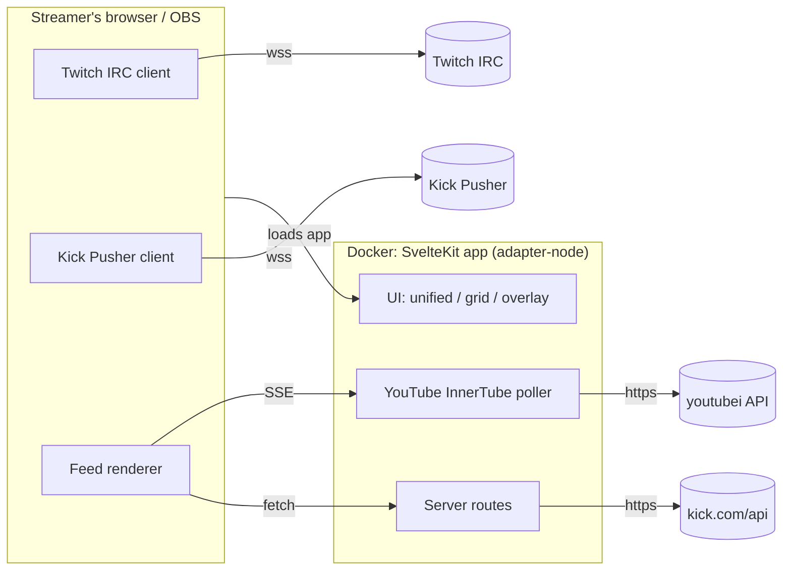

# All Chat — Engineering Design Doc (EDD)

**Status:** Draft
**Date:** 2026-07-19
**Scope:** MVP (v1)

## 1. Overview

All Chat is a web app for streamers who broadcast to multiple platforms simultaneously. It aggregates live chat from Twitch, Kick, and YouTube into a single unified message feed, with a grid view of per-platform chats as a secondary display mode, and first-class OBS integration (dockable panel + on-stream overlay).

The app is read-only in v1: it displays messages but cannot send them. This keeps the MVP free of login/auth flows — every supported platform has an anonymous read path.

### Design principles

- **One app, one container.** A single SvelteKit application serves the UI and provides the small server-side pieces (YouTube polling, Kick lookups) that the browser sandbox cannot do itself. Deployed as a Docker image on the streamer's machine, LAN, or cloud.
- **Server does only what the browser can't.** Twitch and Kick chat connect directly from the browser via WebSocket; the server never touches those messages. Only YouTube ingestion and Kick channel-ID resolution run server-side.
- **Everything is a URL.** Channel config, view mode, and overlay styling ride URL params, so any view can be bookmarked, shared, docked into OBS, or used as a browser source with zero extra setup.
- **No accounts, no secrets.** v1 stores nothing but the user's channel list (localStorage / URL params).

## 2. Goals / Non-goals

### Goals (v1)

- Unified single-window feed merging live chat from Twitch, Kick, and YouTube.
- Grid view: each platform's chat in its own panel, split evenly.
- OBS integration:
  - **Custom browser dock** — the app (unified or grid view) as a panel inside the OBS UI.
  - **Browser source overlay** — transparent-background chat rendered on stream.
- Ships as a Docker image; runs on localhost, LAN, or cloud host.
- No login required for anything in v1.

### Non-goals (v1, deferred to v2)

- **Sending messages** to any platform (requires per-platform OAuth).
- **Facebook Live/Gaming support.** Facebook has no anonymous chat read path — its Graph API requires page tokens, and DOM scraping is fragile. Facebook lands in v2 alongside the auth flow, which it needs anyway.
- Moderation actions (timeouts, bans, deletes).
- Message persistence, search, or analytics.
- Third-party emotes (7TV/BTTV/FFZ) — fragment model accommodates them later.

## 3. Platform ingestion

The central constraint: what can the browser reach directly, and what needs the server?

| Platform | Transport | Anonymous read? | Browser-direct? | Notes |
|----------|-----------|-----------------|-----------------|-------|
| Twitch | IRC over WebSocket (`wss://irc-ws.chat.twitch.tv:443`) | Yes (`justinfan<digits>` nick, no auth) | **Yes** | Rock-solid, documented, used by every chat tool |
| Kick | Pusher WebSocket (public app key) | Yes | **WebSocket yes; lookup no** — channel-name→chatroom-ID via `kick.com/api` is CORS-blocked and behind Cloudflare | Server route resolves the lookup |
| YouTube | InnerTube API polling (`youtubei/v1/live_chat/get_live_chat`) | Yes (no API key/quota — same endpoint the watch page uses) | **No** — CORS-blocked | Server polls, streams to browser via SSE |
| Facebook | Graph API / DOM scraping | No | No | Deferred to v2 |

### 3.1 Twitch (browser-direct)

Anonymous WebSocket to Twitch IRC: `NICK justinfan12345`, `JOIN #channel`, request tags capability (`CAP REQ :twitch.tv/tags`) for display colors, badges, and emote ranges. Parse PRIVMSG into normalized messages. Reconnect with backoff; answer server PING. The IRC subset is small — minimal hand-rolled parser, no library.

### 3.2 Kick (browser WebSocket + server lookup)

1. **Resolve channel → chatroom ID** (server route): `GET https://kick.com/api/v2/channels/{slug}` returns `chatroom.id`. Route caches results; on Cloudflare blocks, UI falls back to prompting for a manually entered chatroom ID.
2. **Subscribe** (browser-direct): Pusher WebSocket with Kick's public app key (`wss://ws-us2.pusher.com/app/<key>?protocol=7`), `pusher:subscribe` to `chatrooms.<id>.v2`. `ChatMessage` events carry sender, badges, color, emote placeholders.

Risk: unofficial API; Kick has churned the Pusher key/cluster before. All Kick constants isolated in one module; breakage treated as expected maintenance.

### 3.3 YouTube (server-side polling → SSE)

The watch page's own chat uses InnerTube's `youtubei/v1/live_chat/get_live_chat` — no API key or quota, but CORS-blocked for third-party origins, so it runs server-side:

1. Resolve input (video URL, video ID, or `@handle`) to a live video ID (`youtube.com/@handle/live` redirect).
2. Fetch the initial live-chat continuation token from the video page.
3. Poll `get_live_chat` at the server-suggested interval (typically ~1–5 s), normalize messages.
4. Stream to the browser over **SSE** (`text/event-stream`) — one-way flow matches a read-only feed and fits SvelteKit server routes natively (no WebSocket server needed).

### 3.4 Server routes (inside the SvelteKit app)

- `GET /api/kick/channel/[slug]` — chatroom ID lookup (cached).
- `GET /api/youtube/resolve/[input]` — URL/ID/handle → live video ID.
- `GET /api/youtube/chat/[videoId]` — SSE stream of normalized messages.
- `GET /api/health` — liveness.

Stateless, no credentials. One poller per active YouTube video, shared across any number of connected clients (refcounted; stops when the last SSE client disconnects).

## 4. Architecture



- Each platform client implements a common `ChatSource` interface: `connect(config)`, `disconnect()`, `onMessage(cb)`, `onStatus(cb)`. Twitch and Kick sources open WebSockets in the browser; the YouTube source opens an `EventSource` to our own server. Adding Facebook in v2 means one more `ChatSource`.
- Per-source connection status (connecting / live / reconnecting / failed) surfaces in the UI.

### 4.1 Normalized message model

```ts
interface ChatMessage {
  id: string;            // platform message id, or synthesized
  platform: 'twitch' | 'kick' | 'youtube';
  channel: string;       // channel the message came from
  timestamp: number;     // epoch ms (arrival time if platform omits it)
  author: {
    name: string;
    color?: string;      // platform-provided or hash-derived
    badges: Badge[];     // normalized: broadcaster, mod, subscriber, verified, ...
  };
  fragments: Fragment[]; // ordered text + emote fragments
}

type Fragment =
  | { kind: 'text'; text: string }
  | { kind: 'emote'; name: string; url: string };
```

Emotes render as inline images from each platform's public CDN (all three serve emote images without auth).

### 4.2 Unified feed behavior

- Messages append in arrival order (not timestamp-sorted — re-sorting causes visual jumping).
- Each message shows a platform icon + platform accent color stripe.
- Auto-scroll with "paused — N new messages" pill when the user scrolls up.
- Ring buffer caps retained messages (default 1,000) to bound memory during long streams.
- High-throughput safety: batch DOM appends per animation frame; virtualize if needed.

### 4.3 Grid view

- CSS grid, evenly split among active platforms (1–3 panes in v1).
- Panes reuse the same feed component, filtered to one platform — consistent styling, no iframes, no embed restrictions.
- View toggle (Unified ⇄ Grid) in the header; choice persisted.

### 4.4 OBS integration (MVP)

Both shapes are plain URLs into the same app:

- **Custom browser dock (panel in OBS):** OBS → Docks → Custom Browser Docks → paste app URL. Full interactive app (unified or grid) inside the OBS window. Nothing special required beyond sane behavior at narrow widths — responsive layout is a v1 requirement.
- **Browser source overlay (on stream):** `/?overlay=1&twitch=foo&kick=bar&youtube=baz`. Overlay mode: transparent background, no chrome (no header/inputs), larger text with stroke/shadow for readability, optional per-message fade-out (`&fade=20` seconds). OBS browser sources support transparency natively.

URL params carry the complete config (`?twitch=...&kick=...&youtube=...&view=unified|grid&overlay=1&fade=N`), so docks and sources survive OBS restarts with no server-side session.

### 4.5 Configuration & persistence

- Setup screen: one input per platform (Twitch channel, Kick channel, YouTube URL/ID/handle). Any subset may be filled.
- Config persists to `localStorage` and is reflected into URL params; a "copy OBS URLs" helper emits ready-made dock/overlay links.

## 5. Tech stack

- **Framework:** SvelteKit + TypeScript, `adapter-node`. One app: UI + server routes. Svelte's compiled output keeps the feed hot path lean; server routes eliminate a separate proxy service.
- **Streaming:** SSE for YouTube (native `ReadableStream` response in a server route). Browser WebSockets for Twitch/Kick.
- **Styling:** hand-rolled CSS, dark theme default (streamers run dark UIs); transparent theme for overlay mode. No CSS framework.
- **Testing:** Vitest for message parsers/normalizers, fixture-driven with recorded real payloads per platform. Parsers are the fragile surface; they get the coverage.
- **Repo layout:**
  ```
  all-chat/
    docs/                 # this doc
    src/
      lib/
        sources/          # ChatSource impls: twitch.ts, kick.ts, youtube.ts
        server/           # InnerTube poller, Kick lookup (server-only)
        components/       # feed, message, grid, overlay
      routes/
        +page.svelte      # main app (unified/grid)
        api/...           # server routes (§3.4)
    static/
    Dockerfile            # multi-stage: build → slim node runtime
    .github/workflows/    # CI: check, test, build, publish image to GHCR
  ```

## 6. Deployment

**Primary: Docker image** (GHCR), run on the streamer's machine, home server/LAN, or any cloud host:

```sh
docker run -p 8420:3000 ghcr.io/<owner>/all-chat
```

Then `http://localhost:8420` (or the LAN/cloud host) in a browser and in OBS dock/source URLs.

Also runs bare with Node (`npm run build && node build/`) for non-Docker users.

**Not pursued for v1:** static-only GitHub Pages build. YouTube ingestion requires the server, and shipping a degraded Twitch/Kick-only tier adds a second build target and support burden for little value. Revisit if demand appears.

Security note: the server exposes only stateless read-only routes, but a cloud deployment is an open relay for YouTube chat polling; if hosted publicly, put it behind basic auth or keep it LAN-only. Documented in the README rather than solved in-app for v1.

## 7. Risks

| Risk | Likelihood | Mitigation |
|------|-----------|------------|
| Kick unofficial API changes (Pusher key, endpoint shape) | Medium | Constants isolated in one module; fixture tests catch shape drift; manual chatroom-ID entry fallback |
| YouTube InnerTube shape changes | Medium | Same isolation + fixtures; poller failures surface as source status in UI |
| Cloudflare blocks server's Kick lookups (esp. from cloud IPs) | Medium | Manual chatroom ID entry always available |
| Twitch anonymous IRC restricted | Low | Would break the entire ecosystem of chat tools; unlikely without notice |
| High-throughput channels (10k+ msg/min) jank the UI | Medium | rAF batching, ring buffer, virtualization if needed |
| OBS embedded browser (CEF) quirks in dock/overlay | Low–Med | CEF is Chromium; avoid bleeding-edge CSS; test dock + source in OBS as a release gate |

## 8. Roadmap

- **v1 (this doc):** read-only unified feed + grid, Twitch/Kick/YouTube, OBS dock + overlay, Docker deploy.
- **v2:** per-platform OAuth; send messages from a unified input to all connected platforms; Facebook Live support (auth unlocks Graph API); moderation passthrough (TBD).
- **Later:** third-party emotes (7TV/BTTV/FFZ), multi-channel-per-platform, message filtering/highlighting, custom overlay theming.

## 9. Open questions

1. Overlay styling surface for v1: just size/fade params, or a small theme editor? Leaning params-only; theming is a rabbit hole.
2. YouTube poller sharing: refcount per video is designed in — is multi-client (streamer's browser + OBS dock + overlay all connected at once) the common case? Yes, likely three concurrent clients; SSE fan-out from one poller handles it.
3. Docker image publishing cadence: tag-based releases vs every-main-commit `:edge`. Proposal: both.
